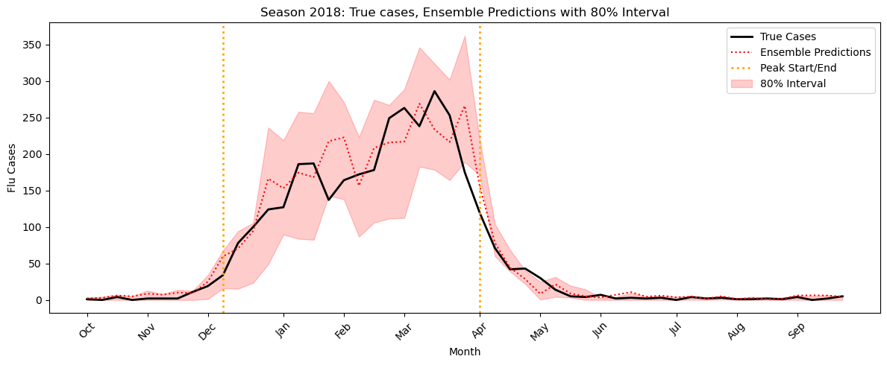

# Influenza Forecasting in the Chicago Area

Forecast weekly positive influenza lab tests in Chicago using machine learning (Linear Regression + XGBoost) with walk‑forward validation. Inputs include Google Trends, weather, vaccination rates, and lab test positivity. Everything is reproducible.

---

## Quickstart

```
git clone https://github.com/tmittelholtz/Influenza-Forecasting-Chicago.git
pip install -r requirements.txt
# open notebooks/1_dataprep.ipynb then notebooks/2_modeling.ipynb and run top to bottom
```

Data CSVs are in `data/` (see below). Seeds are fixed (random_state = 13 for XGBoost); runs are deterministic.

---

## Project Structure

```
.
├── data/                     # CSVs used by the notebooks
├── notebooks/
│   ├── 1_dataprep.ipynb      # cleaning, joining, feature engineering
│   └── 2_modeling.ipynb      # modeling, evaluation, predictive intervals, plots
├── figures/                  # saved figures used in README
├── references/
│   └── data_sources.md       # links + descriptions of all datasets
├── requirements.txt
└── README.md
```

---

## Data Sources

See `references/data_sources.md` for full links and notes.

* Positive lab tests (Chicago Department of Public Health)
* Weather (Meteostat)
* Google Trends
* Vaccination rates (CDC/Illinois)

```
data/
  google_trends.csv
  positive_tests.csv
  vaccination_rates.csv
  weather.csv
```

---

## Data Preparation

### Sources & Ingestion
* Raw CSVs (weather, Google Trends, vaccination rates, positive tests) imported into SQLite tables.  
* Created SQL views (`weather_clean`, `google_trends_clean`, `vaccination_clean`, `positive_tests_clean`) to standardize dates and types.  
* Joined views with left-joins in SQL to produce a unified table keyed on `date_clean`. Converted to Pandas dataframe. 

### Data Cleaning & Transformation
* Converted `date_clean` to `datetime`, sorted chronologically, and set as index.  
* Forward-filled monthly vaccination rates and realigned season resets at October 1 to prevent bleed across seasons.  
* Cleaned Google Trends fields by replacing `'<1'`, casting to numeric, and forward-filling weekly values.  
* Scaled Google Trends data linearly by season (2010–2019) to adjust for usage increase.  

### Feature Engineering
* Defined target `y` as next-week flu cases (`flu_cases.shift(-7)`).  
* Created lag features: `flu_cases_lag_7`, `flu_cases_lag_14`, `flu_cases_lag_21`.  
* Added seasonality flags:  
  * `in_season` (1 if month ∈ Oct–Apr, else 0)  
  * `season_year` (calendar year of season start)  
* Computed 7-day weather summaries:  
  * `tavg_slope` – weighted slope of average temperature  
  * `prcp_sum` – sum of precipitation  

### Missing Data Handling
* Filled remaining missing temperatures with forward-fill; missing precipitation set to 0.  
* Dropped intermediate columns (`flu_cases`, raw `prcp`) and all rows where `y` was null(data now weekly)  
* Filled 2010 initial NaNs in lagged flu case features with zeros.  

### Final Dataset
* Exported the cleaned weekly dataset to `data/clean_flu_data.csv` (no missing values, schema and index included).  

### Reproducibility & Metadata
* All steps are documented in `notebooks/1_dataprep.ipynb`.  
* Schema (column names, types, index) is captured with the output file.  
* Raw source files are included in data/

---

## Modeling & Evaluation

**Goal:** one-week-ahead forecasts of flu cases (`y` shifted +7 days) with no look-ahead.

### Evaluation protocol
* **Leave-one-season-out:** for each `season_year` (after the first), train on all prior seasons and test on that season only.
* **Metrics per season:** RMSE, MAE, R², and RMSE as % of total cases in the season.
* **Summary:** weighted means using seasonal total cases to emphasize high-burden seasons.

### Feature pool
From the prepared weekly table:  
`tavg`, `tavg_slope`, `prcp_sum`, `vax_rate`, `flu_cases_lag_7`, `flu_cases_lag_14`, `flu_cases_lag_21`, `Tamiflu`, `fever`, `Cough`, `flu symptoms`, `sore throat`, `in_season`.

### Baselines
* **Linear Regression (LR)** and **XGBoost (XGB)** as starting points. **Weighted RMSE** = 50/67.5 respectively.
* **Feature Importance** showed different orders for each model, suggesting independent ablation may be more effective.
* Tried a **log-y** specification; it underperformed and was dropped.

### Feature selection & ablation
* Ran per-model **feature ablations** of each feature. Grouped all features that reduced RMSE in each model.
* iteratively evaluated models, exhaustively dropping all combinations in the grouped features.
* Selected compact **feature subsets** for LR and XGB that minimized **weighted RMSE** (kept separate subsets per model).

### Ensembling
* **Ensemble v1 (simple):** 50/50 average of LR and XGB predictions.
  * Underperformed LR in all metrics, but through plotting, suggested that dynamically mixing/boosting models may perform much better.
* **Ensemble v2 (stage-aware):** dynamic LR/XGB weights across epidemic stages:
  * Tagged each season’s timeline as **pre-peak / in-peak / post-peak** using a gradient trigger + percentile filter (single peak per season with no forward information leakage).
  * Parameters: `pre_peak_lr`, `in_peak_lr`, `post_peak_lr`, `transition_width` (smooths between stages), and optional in-peak boosts (`xgb_boost`, `lr_boost`).
  * **Search:** iterative grid search (fixed grid size, ~10 iters) optimizing **weighted RMSE**, biasing later seasons more.
  * Best parameters: **weighted RMSE = 38.87**

### Predictive intervals
* Built model-level **quantiles**:
  * **LR:** `statsmodels` **QuantReg**.
  * **XGB:** `objective="reg:quantileerror"` (with `quantile_alpha`).
* Formed **ensemble intervals** by blending LR/XGB quantiles exactly as Ensemble V2 does:
  * Using direct alphas (95% = (0.025, 0.975) , 80% = (.1, .9)) led to over-coverage. So empirically set the following:
  * **80% interval:** lower/upper = (0.20, 0.80).
  * **95% interval:** lower/upper = (0.05, 0.95).
* **Calibration:** global **shift** `s` and **widen** factor `k` chosen on a grid to hit target coverage (80%/95%) on in-season weeks only, with higher weight on later seasons. Tracked coverage and mean width.

### Outputs
* Per-season tables of metrics for LR, XGB, and both ensembles.
* Saved **best ensemble-v2 params**, per-model predictions, and interval settings.
* Plots: seasonal truth vs. predictions, plus **80% / 95%** interval bands.
* 


**Notes**
* All training uses data strictly prior to the test season; all predictors at time `t` are derived from information available by `t`.
* The code paths let you swap feature sets, models, or ensemble parameters without changing the evaluation split.


## Reproducibility

* All seeds set (random_state=13 etc.).
* Paths are relative (../data/...).
* Notebooks run top-to-bottom without manual edits.

---

## License

MIT. See LICENSE.

---

## Acknowledgments

Thanks to CDC, Meteostat, Google Trends, and Chicago Department of Public Health for data.

Initial prototyping and scaffolding of some helper scripts were assisted by ChatGPT; all logic was reviewed, adapted, and validated by me.

---

